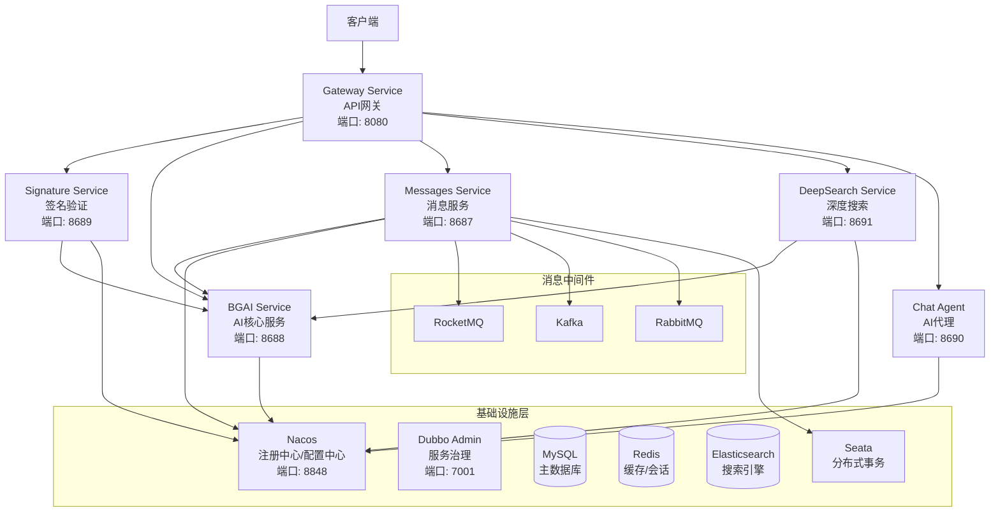

# 江阳AI微服务生态系统

<div align="center">


**企业级AI微服务架构 · 高性能RPC通信 · 分布式事务支持 · 智能消息处理**

</div>

## 📖 项目概述

江阳AI微服务生态系统是一个基于Spring Cloud Gateway的企业级微服务架构，集成了AI智能服务、消息队列处理、深度搜索、分布式事务等核心功能。系统采用Dubbo RPC框架实现高性能服务间通信，支持多种消息中间件，并提供完整的API签名验证和SSO单点登录解决方案。

### 🎯 核心特性

- **🚀 高性能架构**: 基于Dubbo RPC的微服务通信，性能提升2-3倍
- **🤖 AI智能服务**: 集成多种AI模型，提供智能对话和内容分析
- **📨 消息处理**: 支持RocketMQ、Kafka、RabbitMQ多种消息中间件
- **🔍 深度搜索**: 图片识别、AI逻辑分析、数据计算任务处理
- **🔐 安全认证**: 完整的API签名验证和OAuth 2.0 SSO单点登录
- **💾 分布式事务**: 基于Seata的Saga模式分布式事务支持
- **📊 实时监控**: 完善的监控、日志和性能指标收集

## 🏗️ 系统架构

### 整体架构图



### 服务端口分配

| 服务名称 | HTTP端口 | Dubbo端口 | 主要功能 | 状态 |
|---------|----------|-----------|----------|------|
| **gateway-service** | 8080 | - | API网关、路由转发 | ✅ |
| **signature-service** | 8689 | 20881 | 签名验证、SSO认证 | ✅ |
| **bgai-service** | 8688 | 20880 | AI核心服务、业务逻辑 | ✅ |
| **messages-service** | 8687 | 20882 | 消息队列、事务事件 | ✅ |
| **deepSearch-service** | 8691 | 20883 | 深度搜索、图片识别 | ✅ |
| **chat-agent** | 8690 | 20884 | AI智能代理、聊天服务 | ✅ |
| **base-service** | - | - | 基础服务、多数据源 | ✅ |

## 🚀 技术栈

### 核心框架

| 技术 | 版本 | 说明 |
|------|------|------|
| **Java** | 17+ | 基础运行环境 |
| **Spring Boot** | 3.2.5 | 应用框架 |
| **Spring Cloud** | 2023.0.1 | 微服务框架 |
| **Spring Cloud Alibaba** | 2022.0.0.0 | 阿里微服务组件 |
| **Apache Dubbo** | 3.2.8 | RPC通信框架 |
| **Nacos** | 2.0+ | 服务注册发现 |

### 数据存储

| 技术 | 版本 | 用途 |
|------|------|------|
| **MySQL** | 8.0+ | 主数据库 |
| **Redis** | 6.0+ | 缓存、会话 |
| **Elasticsearch** | 8.12.2 | 搜索引擎、日志 |
| **MyBatis Plus** | 3.5.5 | ORM框架 |

### 消息中间件

| 技术 | 版本 | 用途 |
|------|------|------|
| **RocketMQ** | 2.2.3 | 消息队列 |
| **Kafka** | - | 流处理 |
| **RabbitMQ** | - | 消息代理 |

### 监控运维

| 技术 | 版本 | 用途 |
|------|------|------|
| **Spring Boot Actuator** | 3.2.5 | 健康检查 |
| **Micrometer** | - | 指标收集 |
| **Dubbo Admin** | 3.2.8 | 服务治理 |

## 📦 模块结构

```
jiangyangai/
├── 📁 gateway-service/           # API网关服务
│   ├── 路由配置
│   ├── 过滤器链
│   └── 负载均衡
├── 📁 signature-service/         # 签名验证服务
│   ├── API签名验证
│   ├── SSO单点登录
│   ├── OAuth 2.0授权
│   └── 用户权限管理
├── 📁 bgai-service/              # AI核心业务服务
│   ├── AI模型集成
│   ├── 业务逻辑处理
│   ├── Dubbo服务提供
│   └── 外部API调用
├── 📁 messages-service/           # 消息处理服务
│   ├── 消息队列管理
│   ├── 事务事件处理
│   ├── Saga状态机
│   └── 消息生命周期
├── 📁 deepSearch-service/         # 深度搜索服务
│   ├── 图片识别处理
│   ├── AI逻辑分析
│   ├── 数据计算任务
│   └── 结果存储管理
├── 📁 chat-agent/                 # AI智能代理
│   ├── 多模型集成
│   ├── 智能对话
│   ├── 上下文管理
│   └── 响应优化
├── 📁 base-service/               # 基础服务模块
│   ├── 多数据源管理
│   ├── 通用配置
│   ├── 工具类库
│   └── 基础组件
├── 📁 dubbo-api/                  # 公共API接口
│   ├── 服务接口定义
│   ├── 数据传输对象
│   ├── 通用响应模型
│   └── 异常处理
└── 📁 logs/                       # 日志文件
```

## 🔧 快速开始

> ⚠️ **安全提醒**: 本文档中的配置示例仅用于演示目的，实际部署时请：
> - 使用强密码替换示例中的 `your_password`、`your_username` 等占位符
> - 不要在代码仓库中提交包含真实密码的配置文件
> - 使用环境变量或配置中心管理敏感信息

### 环境要求

- **JDK**: 17+
- **Maven**: 3.6+
- **MySQL**: 8.0+
- **Redis**: 6.0+
- **Nacos**: 2.0+
- **Elasticsearch**: 8.12.2 (可选)

### 1. 克隆项目

```bash
git clone https://github.com/your-username/jiangyangai.git
cd jiangyangai
```

### 2. 启动基础设施

#### 启动Nacos (服务注册中心)

```bash
# 使用Docker启动
docker run -d \
  --name nacos-standalone \
  -e MODE=standalone \
  -e JVM_XMS=512m \
  -e JVM_XMX=512m \
  -p 8848:8848 \
  nacos/nacos-server:latest

# 访问控制台: http://localhost:8848/nacos
# 用户名: nacos, 密码: nacos
```

#### 启动MySQL

```bash
docker run -d \
  --name mysql8 \
  -e MYSQL_ROOT_PASSWORD=your_password \
  -e MYSQL_DATABASE=jiangyangai \
  -p 3306:3306 \
  mysql:8.0
```

#### 启动Redis

```bash
docker run -d \
  --name redis6 \
  -p 6379:6379 \
  redis:6.0-alpine
```

### 3. 配置数据库

```sql
-- 创建数据库
CREATE DATABASE jiangyangai CHARACTER SET utf8mb4 COLLATE utf8mb4_unicode_ci;

-- 执行初始化脚本 (参考各服务的SQL文件)
-- 注意：具体的表结构和数据请参考各服务的SQL文件
```

### 4. 编译项目

```bash
# 编译所有模块
mvn clean compile -DskipTests

# 安装dubbo-api到本地仓库
cd dubbo-api
mvn clean install -DskipTests
cd ..

# 编译各服务
mvn clean package -DskipTests
```

### 5. 启动服务

#### 启动顺序

1. **base-service** (基础服务)
2. **signature-service** (签名验证)
3. **bgai-service** (AI核心服务)
4. **messages-service** (消息服务)
5. **deepSearch-service** (深度搜索)
6. **chat-agent** (AI代理)
7. **gateway-service** (API网关)

#### 启动命令

```bash
# 启动signature-service
cd signature-service
java -jar target/signature-service-1.0.0-Final.jar

# 启动bgai-service
cd ../bgai-service
java -jar target/bgai-service-1.0.0-Final.jar

# 启动messages-service
cd ../messages-service
java -jar target/messages-service-1.0.0-Final.jar

# 启动gateway-service
cd ../gateway-service
java -jar target/gateway-service-1.0.0-Final.jar
```

### 6. 验证部署

```bash
# 检查服务健康状态
curl http://localhost:8688/actuator/health  # bgai-service
curl http://localhost:8689/actuator/health  # signature-service
curl http://localhost:8687/actuator/health  # messages-service
curl http://localhost:8080/actuator/health  # gateway-service

# 测试网关路由
curl http://localhost:8080/api/signature/health
```

## 🔐 认证与授权

### API签名验证

系统采用HMAC-SHA256签名算法，确保API调用的安全性：

#### 签名参数

- **appId**: 应用标识
- **timestamp**: 时间戳 (毫秒)
- **nonce**: 随机字符串
- **sign**: 签名值
- **params**: 业务参数

#### 签名生成示例

```bash
POST /api/signature/generate
Content-Type: application/json

{
  "appId": "test-app-001",
  "secret": "your-secret-key",
  "params": {
    "userId": "user123",
    "action": "getUserInfo"
  }
}
```

#### 签名验证示例

```bash
POST /api/signature/verify
Content-Type: application/json

{
  "appId": "test-app-001",
  "timestamp": "1703123456789",
  "nonce": "a1b2c3d4e5f6",
  "sign": "generated_signature",
  "params": {
    "userId": "user123"
  }
}
```

### SSO单点登录

系统支持完整的OAuth 2.0流程：

#### 授权码流程

```bash
# 1. 获取授权码
GET /api/sso/authorize?client_id=client&response_type=code&redirect_uri=xxx

# 2. 使用授权码获取令牌
POST /api/sso/token
{
  "grant_type": "authorization_code",
  "code": "auth_code",
  "client_id": "client",
  "client_secret": "secret"
}
```

#### 密码授权流程

```bash
POST /api/sso/token
{
  "grant_type": "password",
  "username": "user",
  "password": "pass",
  "client_id": "client",
  "client_secret": "secret"
}
```

## 📨 消息服务

### 消息中间件支持

**messages-service** 支持多种消息中间件，提供统一的消息处理接口：

#### RocketMQ

```java
// 发送消息
@Autowired
private RocketMQTemplateService rocketMQTemplateService;

boolean success = rocketMQTemplateService.sendMessage(
    "topic-name", 
    "tag-name", 
    "message-key", 
    "message-content"
);
```

#### Kafka

```java
// 发送消息
@Autowired
private KafkaMessageService kafkaMessageService;

boolean success = kafkaMessageService.sendMessage(
    "topic-name", 
    "message-key", 
    "message-content"
);
```

#### RabbitMQ

```java
// 发送消息
@Autowired
private RabbitMQMessageService rabbitMQMessageService;

boolean success = rabbitMQMessageService.sendMessage(
    "exchange-name", 
    "routing-key", 
    "message-content"
);
```

### Saga分布式事务

系统基于Seata实现Saga模式的分布式事务：

```java
@GlobalTransactional
public void executeMessageSendSaga(MessageRequest request) {
    // 1. 创建消息记录
    Message message = createMessage(request);
    
    // 2. 发送消息到队列
    boolean sent = sendMessageToQueue(message);
    
    // 3. 更新消息状态
    updateMessageStatus(message.getId(), "SENT");
    
    // 4. 记录审计日志
    recordAuditLog(message.getId(), "SAGA_COMPLETED");
}
```

## 🔍 深度搜索服务

### 服务概述

**deepSearch-service** 是一个专门处理图片识别、AI逻辑分析和数据计算任务的微服务。该服务通过集成AI代理和BGAI服务，实现智能化的数据处理流程。

### 核心功能

#### 1. 图片上传与识别
- **多格式支持**: 支持JPG、PNG、GIF、PDF等多种格式
- **批量处理**: 支持多图片同时上传和处理
- **智能识别**: 自动识别图片内容并生成结构化数据
- **SQL生成**: 基于识别结果自动生成SQL语句

#### 2. AI逻辑分析
- **业务流程分析**: 自动分析业务逻辑流程
- **流程图生成**: 生成完整的业务流程图
- **文字描述**: 提供详细的逻辑说明文档
- **多业务类型**: 支持订单管理、用户管理等多种业务场景

#### 3. 数据计算处理
- **同步计算**: 实时数据计算和结果返回
- **异步任务**: 支持长时间运行的计算任务
- **任务跟踪**: 提供计算任务状态跟踪
- **结果存储**: 自动存储计算结果到MySQL数据库

### 技术架构

- **Spring Boot 3.2.5**: 核心框架
- **Spring Cloud**: 服务发现和配置管理
- **Dubbo**: 服务间RPC通信
- **MyBatis Plus**: 数据持久化
- **Redis**: 缓存和会话管理
- **MySQL**: 数据存储
- **Elasticsearch**: 搜索结果存储

### 主要接口

#### 图片处理接口

```bash
# 图片上传和识别
POST /api/calculation/upload
Content-Type: multipart/form-data

# 查询识别结果
GET /api/calculation/result/{taskId}

# 批量图片处理
POST /api/calculation/batch-upload
```

#### AI分析接口

```bash
# 业务逻辑分析
POST /api/calculation/analyze
Content-Type: application/json

{
  "businessType": "order_management",
  "requirements": "分析订单处理流程",
  "inputData": "订单数据样本"
}

# 获取分析结果
GET /api/calculation/analysis/{analysisId}
```

#### 数据计算接口

```bash
# 执行数据计算
POST /api/calculation/execute
Content-Type: application/json

{
  "taskType": "data_aggregation",
  "parameters": {
    "table": "orders",
    "groupBy": "status",
    "aggregation": "count",
    "filters": {
      "dateRange": "2024-01-01,2024-12-31"
    }
  }
}

# 查询计算状态
GET /api/calculation/status/{taskId}

# 取消计算任务
POST /api/calculation/cancel/{taskId}

# 获取计算结果
GET /api/calculation/result/{taskId}"
```

### 业务流程

1. **图片上传** → 网关路由 → 认证服务验证
2. **异步识别** → BGAI服务处理图片 → 生成SQL并存储
3. **AI分析** → 请求AI代理 → 生成逻辑流程图
4. **逻辑提交** → 通过Dubbo发送到BGAI服务
5. **数据计算** → 执行计算规则 → 返回结果

### 配置说明

> ⚠️ **注意**: 以下配置示例中的数据库连接信息仅用于演示，实际使用时请替换为真实值。

```yaml
# application-dev.yml
server:
  port: 8691

spring:
  application:
    name: deepSearch-service
    
  datasource:
    dynamic:
      primary: master
      strict: false
      datasource:
        master:
          url: jdbc:mysql://localhost:3306/deepsearch
          username: your_username
          password: your_password
          
  redis:
    host: localhost
    port: 6379
    
  elasticsearch:
    uris: http://localhost:9200
    
dubbo:
  application:
    name: deepSearch-service
  registry:
    address: nacos://localhost:8848
  protocol:
    port: 20883
```

## 📨 消息服务

### 服务概述

**messages-service** 是一个专门处理消息队列、事务事件和消息生命周期的微服务。该服务支持多种消息中间件，提供统一的消息处理接口，并基于Seata实现分布式事务管理。

### 核心功能

#### 1. 消息队列管理
- **多中间件支持**: RocketMQ、Kafka、RabbitMQ
- **统一接口**: 提供标准化的消息发送和接收接口
- **消息路由**: 智能路由消息到合适的队列
- **负载均衡**: 支持消息的负载均衡分发

#### 2. 事务事件处理
- **分布式事务**: 基于Seata的Saga模式
- **事件驱动**: 支持事件驱动的业务流程
- **状态管理**: 完整的消息状态生命周期管理
- **回滚机制**: 支持事务失败时的自动回滚

#### 3. 消息生命周期
- **创建**: 消息创建和初始化
- **发送**: 消息发送到队列
- **确认**: 消息发送确认和状态更新
- **消费**: 消息消费和处理
- **归档**: 消息历史记录和审计

#### 4. 审计日志
- **操作记录**: 记录所有消息操作
- **状态跟踪**: 实时跟踪消息状态变化
- **性能监控**: 监控消息处理性能
- **异常记录**: 记录处理异常和错误

### 技术架构

- **Spring Boot 3.2.5**: 核心框架
- **Spring Cloud**: 服务发现和配置管理
- **Dubbo**: 服务间RPC通信
- **MyBatis Plus**: 数据持久化
- **Seata**: 分布式事务管理
- **RocketMQ**: 消息队列
- **Kafka**: 流处理
- **RabbitMQ**: 消息代理
- **Elasticsearch**: 消息日志存储
- **Redis**: 缓存和会话管理

### 主要接口

#### 消息发送接口

```bash
# 发送消息到指定队列
POST /api/messages/saga/send
Content-Type: application/json

{
  "messageId": "msg-001",
  "topic": "user-events",
  "tag": "user-register",
  "key": "user-123",
  "content": "用户注册事件数据",
  "messageType": "ROCKETMQ"
}

# 批量发送消息
POST /api/messages/batch-send
Content-Type: application/json

{
  "messages": [
    {
      "topic": "order-events",
      "content": "订单创建事件"
    },
    {
      "topic": "payment-events", 
      "content": "支付完成事件"
    }
  ]
}
```

#### 消息查询接口

```bash
# 查询消息状态
GET /api/messages/status/{messageId}

# 查询消息历史
GET /api/messages/history?topic={topic}&startDate={startDate}&endDate={endDate}

# 查询消息统计
GET /api/messages/stats?topic={topic}&timeRange={timeRange}
```

#### 事务管理接口

```bash
# 开始分布式事务
POST /api/messages/saga/begin
Content-Type: application/json

{
  "businessKey": "order-123",
  "timeout": 30000
}

# 提交事务
POST /api/messages/saga/commit/{transactionId}

# 回滚事务
POST /api/messages/saga/rollback/{transactionId}

# 查询事务状态
GET /api/messages/saga/status/{transactionId}
```

#### 健康检查接口

```bash
# 服务健康状态
GET /api/messages/saga/health

# 消息队列健康状态
GET /api/messages/health/queues

# 数据库连接状态
GET /api/messages/health/database
```

### 消息中间件配置

#### RocketMQ配置

```yaml
message:
  service:
    rocketmq:
      name-server: localhost:9876
      producer:
        group: messages-producer-group
        send-message-timeout: 3000
        retry-times-when-send-failed: 2
      consumer:
        group: messages-consumer-group
        pull-batch-size: 10
```

#### Kafka配置

```yaml
message:
  service:
    kafka:
      bootstrap-servers: localhost:9092
      producer:
        key-serializer: org.apache.kafka.common.serialization.StringSerializer
        value-serializer: org.apache.kafka.common.serialization.StringSerializer
        acks: all
      consumer:
        group-id: messages-consumer-group
        auto-offset-reset: earliest
        enable-auto-commit: false
```

#### RabbitMQ配置

```yaml
message:
  service:
    rabbitmq:
      host: localhost
      port: 5672
      username: guest
      password: guest
      virtual-host: /
      publisher-confirm-type: correlated
      publisher-returns: true
```

### Saga分布式事务实现

#### 状态机定义

```java
@Configuration
@EnableStateMachine
public class MessageSagaStateMachineConfig extends StateMachineConfigurerAdapter<String, String> {
    
    @Override
    public void configure(StateMachineStateConfigurer<String, String> states) throws Exception {
        states
            .withStates()
            .initial("INIT")
            .state("CREATED")
            .state("SENDING")
            .state("SENT")
            .state("CONFIRMED")
            .state("FAILED");
    }
    
    @Override
    public void configure(StateMachineTransitionConfigurer<String, String> transitions) throws Exception {
        transitions
            .withExternal()
                .source("INIT").target("CREATED")
                .event("CREATE")
                .and()
            .withExternal()
                .source("CREATED").target("SENDING")
                .event("SEND")
                .and()
            .withExternal()
                .source("SENDING").target("SENT")
                .event("SUCCESS")
                .and()
            .withExternal()
                .source("SENDING").target("FAILED")
                .event("FAILURE");
  }
}
```

#### 事务执行流程

```java
@GlobalTransactional
public void executeMessageSendSaga(MessageRequest request) {
    try {
        // 1. 创建消息记录
        Message message = createMessage(request);
        
        // 2. 发送消息到队列
        boolean sent = sendMessageToQueue(message);
        
        if (sent) {
            // 3. 更新消息状态
            updateMessageStatus(message.getId(), "SENT");
            
            // 4. 记录审计日志
            recordAuditLog(message.getId(), "SAGA_COMPLETED");
            
            // 5. 发送事务事件
            sendTransactionEvent(message.getId(), "SUCCESS");
        } else {
            throw new RuntimeException("消息发送失败");
        }
    } catch (Exception e) {
        // 6. 事务回滚处理
        rollbackTransaction(request.getBusinessKey());
        throw e;
  }
}
```

### 监控和告警

#### 性能指标

- **消息发送成功率**: 目标 > 99.5%
- **消息处理延迟**: 目标 < 100ms
- **事务成功率**: 目标 > 99.9%
- **队列积压监控**: 实时监控队列深度

#### 告警规则

```yaml
alerts:
  message-send-failure:
    threshold: 5
    time-window: 1m
    action: "发送告警通知"
    
  queue-accumulation:
    threshold: 1000
    time-window: 5m
    action: "扩容消费者实例"
    
  transaction-failure:
    threshold: 3
    time-window: 1m
    action: "立即告警并人工介入"
```

### 配置说明

> ⚠️ **注意**: 以下配置示例中的数据库连接信息仅用于演示，实际使用时请替换为真实值。

```yaml
# application-dev.yml
server:
  port: 8687

spring:
  application:
    name: messages-service
    
  datasource:
    dynamic:
      primary: master
      strict: false
      datasource:
        master:
          url: jdbc:mysql://localhost:3306/messages_master
          username: your_username
          password: your_password
        slave:
          url: jdbc:mysql://localhost:3306/messages_slave
          username: your_username
          password: your_password
        audit:
          url: jdbc:mysql://localhost:3306/messages_audit
          username: your_username
          password: your_password
          
  redis:
    host: localhost
    port: 6379
    
  elasticsearch:
    uris: http://localhost:9200
    
dubbo:
  application:
    name: messages-service
  registry:
    address: nacos://localhost:8848
  protocol:
    port: 20882
    
seata:
  tx-service-group: messages-service-group
  service:
    vgroup-mapping:
      messages-service-group: default
    grouplist:
      default: localhost:8091
  registry:
    type: nacos
    nacos:
      server-addr: localhost:8848
      namespace: public
      group: SEATA_GROUP
  config:
    type: nacos
    nacos:
      server-addr: localhost:8848
      namespace: public
      group: SEATA_GROUP
      data-id: seataServer.properties
```

## 🤖 AI智能服务

### 多模型集成

**chat-agent** 集成多种AI模型，提供统一的智能对话接口：

#### 支持的模型

- **OpenAI GPT**: 文本生成和对话
- **Claude**: 智能问答和分析
- **本地模型**: 离线AI推理
- **自定义模型**: 业务专用AI

#### 使用示例

```bash
POST /api/chat/conversation
Content-Type: application/json

{
  "model": "gpt-4",
  "messages": [
    {"role": "user", "content": "你好，请介绍一下自己"}
  ],
  "temperature": 0.7
}
```

## 📊 监控与运维

### 健康检查

所有服务都集成了Spring Boot Actuator：

```bash
# 健康状态
GET /actuator/health

# 指标信息
GET /actuator/metrics

# 环境信息
GET /actuator/env

# 配置信息
GET /actuator/configprops
```

### Dubbo服务治理

访问Dubbo Admin查看服务状态：

```bash
# 启动Dubbo Admin
docker run -d \
  --name dubbo-admin \
  -p 7001:7001 \
  -e admin.registry.address=nacos://localhost:8848 \
  apache/dubbo-admin:latest

# 访问: http://localhost:7001
```

### 日志管理

系统使用统一的日志配置，支持结构化日志输出：

```yaml
logging:
  level:
    com.jiangyang: INFO
    org.apache.dubbo: INFO
    org.springframework.cloud.gateway: DEBUG
  pattern:
    console: "%d{yyyy-MM-dd HH:mm:ss} [%thread] %-5level %logger{36} - %msg%n"
```

## 🚀 性能优化

### Dubbo RPC优化

相比HTTP调用，Dubbo RPC带来显著性能提升：

| 指标 | HTTP调用 | Dubbo RPC | 提升幅度 |
|------|----------|-----------|----------|
| 响应时间 | 50-100ms | 30-50ms | **30-50%** |
| 吞吐量 | 1000 TPS | 2000-3000 TPS | **2-3倍** |
| 序列化效率 | JSON | Hessian2 | **3-5倍** |
| 连接复用 | 短连接 | 长连接 | **显著提升** |

### 配置优化

```yaml
dubbo:
  protocol:
    threads: 200        # 业务线程池
    iothreads: 4        # IO线程池
    accepts: 1000       # 最大连接数
    payload: 8388608    # 8MB最大包大小

  consumer:
    connections: 4      # 每个提供者连接数
    actives: 200        # 最大并发调用数
    loadbalance: leastactive  # 最少活跃调用数
```

## 🐳 容器化部署

### Docker部署

#### 构建镜像

```bash
# 构建各服务镜像
docker build -t jiangyang/signature-service:1.0.0 signature-service/
docker build -t jiangyang/bgai-service:1.0.0 bgai-service/
docker build -t jiangyang/messages-service:1.0.0 messages-service/
docker build -t jiangyang/gateway-service:1.0.0 gateway-service/
```

#### Docker Compose

```yaml
version: '3.8'
services:
  nacos:
    image: nacos/nacos-server:latest
    environment:
      - MODE=standalone
    ports:
      - "8848:8848"
    
  signature-service:
    image: jiangyang/signature-service:1.0.0
    ports:
      - "8689:8689"
      - "20881:20881"
    depends_on:
      - nacos
      - mysql
      - redis
    
  bgai-service:
    image: jiangyang/bgai-service:1.0.0
    ports:
      - "8688:8688"
      - "20880:20880"
    depends_on:
      - nacos
      - signature-service
    
  gateway-service:
    image: jiangyang/gateway-service:1.0.0
    ports:
      - "8080:8080"
    depends_on:
      - nacos
      - signature-service
      - bgai-service
```

### Kubernetes部署

```yaml
# k8s/deployment.yaml
apiVersion: apps/v1
kind: Deployment
metadata:
  name: signature-service
spec:
  replicas: 3
  selector:
    matchLabels:
      app: signature-service
  template:
    metadata:
      labels:
        app: signature-service
    spec:
      containers:
      - name: signature-service
        image: jiangyang/signature-service:1.0.0
        ports:
        - containerPort: 8689
        - containerPort: 20881
        env:
        - name: NACOS_HOST
          value: "nacos-service"
        - name: DUBBO_HOST
          valueFrom:
            fieldRef:
              fieldPath: status.podIP
```

## 🧪 测试指南

### 单元测试

```bash
# 运行所有测试
mvn test

# 运行特定模块测试
cd signature-service
mvn test

# 生成测试报告
mvn surefire-report:report
```

### 集成测试

```bash
# 启动测试环境
docker-compose -f docker-compose.test.yml up -d

# 运行集成测试
mvn verify -P integration-test

# 清理测试环境
docker-compose -f docker-compose.test.yml down
```

### 性能测试

```bash
# 使用JMeter进行性能测试
jmeter -n -t performance-test.jmx -l results.jtl

# 使用Gatling进行负载测试
mvn gatling:test
```

## 🔧 故障排除

### 常见问题

#### 1. 服务启动失败

**症状**: 服务启动时出现异常

**解决方案**:
```bash
# 检查端口占用
netstat -tulpn | grep :8080

# 检查依赖服务
curl http://localhost:8848/nacos

# 查看详细日志
tail -f logs/application.log
```

#### 2. Dubbo服务调用失败

**症状**: No provider available for the service

**解决方案**:
```bash
# 检查服务注册状态
curl http://localhost:8848/nacos/v1/ns/instance/list?serviceName=signature-service

# 检查Dubbo配置
grep -r "dubbo" src/main/resources/

# 重启相关服务
```

#### 3. 数据库连接失败

**症状**: Could not create connection to database server

**解决方案**:
```bash
# 检查数据库状态
docker exec -it mysql8 mysql -u your_username -p

# 检查网络连接
telnet localhost 3306

# 验证连接配置
cat src/main/resources/application.yml
```

### 日志分析

#### 启用调试日志

```yaml
logging:
  level:
    com.jiangyang: DEBUG
    org.apache.dubbo: DEBUG
    org.springframework.cloud.gateway: DEBUG
    org.springframework.web: DEBUG
```

#### 查看关键日志

```bash
# 查看错误日志
grep "ERROR" logs/application.log

# 查看Dubbo相关日志
grep "Dubbo" logs/application.log

# 查看网关日志
grep "Gateway" logs/gateway-service.log
```

## 📚 API文档

### Swagger文档

各服务都集成了Swagger文档：

```bash
# signature-service
http://localhost:8689/swagger-ui.html

# bgai-service
http://localhost:8688/swagger-ui.html

# messages-service
http://localhost:8687/swagger-ui.html
```

### Postman集合

项目提供了完整的Postman测试集合：

```bash
# 导入Postman集合
docs/postman/jiangyangai-api-collection.json
```

## 🤝 贡献指南

### 开发流程

1. **Fork项目**
2. **创建特性分支**: `git checkout -b feature/amazing-feature`
3. **提交更改**: `git commit -m 'Add amazing feature'`
4. **推送分支**: `git push origin feature/amazing-feature`
5. **创建Pull Request**

### 代码规范

- 遵循Java编码规范
- 使用统一的代码格式化配置
- 编写完整的单元测试
- 更新相关文档

### 提交规范

```
feat: 新功能
fix: 修复bug
docs: 文档更新
style: 代码格式调整
refactor: 代码重构
test: 测试相关
chore: 构建过程或辅助工具的变动
```

## 🔒 安全配置最佳实践

### 敏感信息管理

1. **环境变量配置**
   ```bash
   # 使用环境变量管理敏感信息
   export DB_USERNAME=your_username
   export DB_PASSWORD=your_password
   export NACOS_USERNAME=your_nacos_username
   export NACOS_PASSWORD=your_nacos_password
   ```

2. **配置文件安全**
   ```yaml
   # 不要在配置文件中硬编码密码
   spring:
     datasource:
       url: jdbc:mysql://${DB_HOST:localhost}:${DB_PORT:3306}/${DB_NAME}
       username: ${DB_USERNAME}
       password: ${DB_PASSWORD}
   ```

3. **密钥管理**
   - 使用密钥管理服务（如HashiCorp Vault、AWS Secrets Manager）
   - 定期轮换密钥和密码
   - 使用强密码策略

4. **网络安全**
   - 生产环境使用HTTPS
   - 配置防火墙规则
   - 限制数据库访问IP范围

### 生产环境部署检查清单

- [ ] 所有默认密码已更改
- [ ] 敏感配置使用环境变量
- [ ] 数据库连接使用专用用户（非root）
- [ ] 网络端口已限制访问
- [ ] 日志中不包含敏感信息
- [ ] 定期备份和恢复测试

## 📄 许可证

本项目采用 [MIT License](LICENSE) 许可证。

## 📞 联系我们

- **项目维护者**: 江阳AI团队
- **邮箱**: support@jiangyang.ai
- **项目地址**: https://github.com/jiangyangai/jiangyangai
- **文档地址**: https://docs.jiangyang.ai

## 🙏 致谢

感谢以下开源项目和技术社区的支持：

- [Spring Boot](https://spring.io/projects/spring-boot)
- [Apache Dubbo](https://dubbo.apache.org/)
- [Nacos](https://nacos.io/)
- [Seata](https://seata.io/)
- [RocketMQ](https://rocketmq.apache.org/)

---

<div align="center">

**如果这个项目对你有帮助，请给它一个 ⭐️**

*让AI技术更好地服务人类*

</div>
