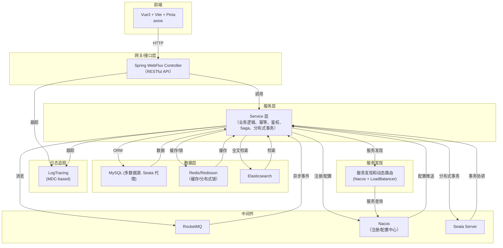

# BGAI-SERVICE 智能服务平台

## 项目简介

BGAI-SERVICE 是一套基于 Spring Boot 3、Spring Cloud Alibaba、Seata、MyBatis-Plus、RocketMQ、Elasticsearch、Redis/Redisson、Pinia+Vue3 的企业级智能 AI 服务平台。支持多数据源、分布式事务、微服务注册与配置、消息队列、缓存、全文检索等能力，前后端分离，支持高并发与高可用。

---

## 技术架构图



---

## 技术栈

### 后端

- **Spring Boot 3.2.x**
- **Spring Cloud 2023.x** + **Spring Cloud Alibaba**
- **Seata**（分布式事务）
- **MyBatis-Plus**（高效 ORM）
- **Druid**（多数据源、SQL监控）
- **RocketMQ**（消息队列）
- **Elasticsearch**（全文检索）
- **Redis/Redisson**（缓存/分布式锁）
- **Caffeine**（本地缓存）
- **Nacos**（注册中心/配置中心）
- **Log Tracing**（基于 MDC 的分布式日志追踪）
- **动态路由**（基于 Nacos 的服务发现和负载均衡）

### 前端

- **Vue 3**
- **Vite**
- **Pinia**（状态管理）
- **Vue Router**
- **Axios**
- **ESLint**

---

## 目录结构

```
bgai/
├── src/
│   ├── main/
│   │   ├── java/com/bgpay/bgai/    # 后端主代码
│   │   └── resources/              # 配置、SQL、Saga、Mapper等
│   └── test/                       # 后端测试
├── frontend/                       # 前端 Vue3 + Vite + Pinia
├── Dockerfile                      # 标准 Docker 构建文件
├── Dockerfile.quick               # 快速构建 Docker 文件（针对中国网络环境优化）
├── docker-compose.yml              # 一键启动依赖服务
├── README.md                       # 项目说明
├── README-dockerfile.md           # Docker 构建详细说明
└── ...                             # 其他脚本、文档、工具
```

---

## 快速启动

### 1. 环境准备

- JDK 21
- Maven 3.8+
- Node.js 18+
- Docker & Docker Compose

### 2. 启动依赖服务

```bash
docker-compose up -d
```
> 包含 MySQL、Redis、Nacos、RocketMQ、Elasticsearch、Seata-Server 等

## 优化版 Docker Compose 环境

我们提供了一个经过优化的 `docker-compose.yml` 文件，包含了完整的本地开发和测试环境：

### 包含的服务

- **bgai-service-app**: 主应用服务
- **mysql**: MySQL 8.0 数据库
- **redis**: Redis 7.0 带密码
- **elasticsearch**: Elasticsearch 8.9.2 单节点
- **nacos**: Nacos 2.2.0 服务注册与配置中心
- **seata**: Seata 1.7.0 分布式事务协调器
- **rocketmq**: RocketMQ 4.9.4 消息队列（包含 namesrv 和 broker）
- **prometheus**: Prometheus 2.44.0 监控数据收集（可选）
- **grafana**: Grafana 9.5.2 监控数据可视化（可选）

### 关键特性

- **服务健康检查**: 使用 `healthcheck` 确保依赖服务在正确的顺序启动
- **持久化数据**: 所有服务的数据都使用命名卷持久化保存
- **环境变量**: 主应用的所有配置都通过环境变量注入
- **自动初始化**: 数据库自动导入初始化脚本
- **监控**: 集成 Prometheus 和 Grafana 监控系统

### 使用方式

**启动所有必要服务:**
```bash
docker-compose up -d
```

**只启动必需服务（不包括监控系统）:**
```bash
docker-compose up -d bgai-service-app mysql redis elasticsearch nacos seata rocketmq-namesrv rocketmq-broker
```

**查看服务日志:**
```bash
# 查看所有服务日志
docker-compose logs -f

# 查看特定服务日志
docker-compose logs -f bgai-service-app
```

**访问各服务:**
- 主应用: http://localhost:8688
- Nacos控制台: http://localhost:8848/nacos (用户名/密码: nacos/nacos)
- Prometheus: http://localhost:9090
- Grafana: http://localhost:3000 (用户名/密码: admin/admin)

**关闭所有服务:**
```bash
docker-compose down
```

**关闭服务并删除所有数据:**
```bash
docker-compose down -v
```

### 3. 启动后端

```bash
./mvnw clean package -DskipTests
java -jar target/bgai-service-0.0.1-SNAPSHOT.jar
# 或
./start.sh
```

### 4. 启动前端

```bash
cd frontend
npm install
npm run dev
```
访问：http://localhost:5173

### 5. Docker 构建和运行

```bash
# 标准构建
docker build -t bgai-service:latest .

# 快速构建（优化中国网络环境）
docker build -f Dockerfile.quick -t bgai-service:latest .

# 运行容器
docker run -p 8688:8688 -e SPRING_PROFILES_ACTIVE=dev bgai-service:latest
```
> 更多 Docker 构建选项详见 [Docker 构建指南](README-dockerfile.md)

---

## 主要功能

- 多数据源动态路由
- 分布式事务（Seata 自动代理）
- 微服务注册/配置（Nacos）
- 消息队列（RocketMQ）
- 缓存/分布式锁（Redis/Redisson/Caffeine）
- 全文检索（Elasticsearch）
- Saga 状态机
- 前后端分离
- 分布式日志追踪（基于 MDC 的 traceId 和 userId 追踪）
- 动态服务发现和路由（基于 Nacos 的服务发现和负载均衡）
- 丰富的脚本和 Docker 支持

---

## 重要约定与最佳实践

- 数据源代理：所有物理数据源由 Seata 自动代理，dynamicDataSource 只做路由。
- 分布式事务：只需在业务方法上加 `@GlobalTransactional`。
- 配置管理：所有环境变量、数据库连接、MQ等均可通过 Nacos 配置中心集中管理。
- 前端开发：推荐使用 VSCode + Volar 插件。
- 日志追踪：所有请求会自动分配 traceId，可通过日志追踪完整调用链路。
- 服务调用：使用动态路由工具类进行微服务间通信，支持同步和响应式调用方式。

---

## 日志追踪系统

系统集成了基于 MDC 的分布式日志追踪功能：

- 每个请求自动分配唯一 traceId
- 自动关联用户 userId（如果已认证）
- 支持 WebMvc 和 WebFlux 两种 Web 框架
- 日志格式包含 traceId 和 userId，便于问题排查
- 与 Logstash 集成，支持集中式日志分析

使用示例：
```java
// 不需要手动设置 traceId，拦截器会自动处理
// 但如有需要，可以手动获取当前 trace 信息
String traceId = LogUtils.getTraceId();
String userId = LogUtils.getUserId();

// 记录业务日志时会自动包含追踪信息
logger.info("业务操作完成");
```

---

## 服务发现和动态路由

系统集成了基于 Nacos 的服务发现和动态路由功能：

- 支持服务自动注册到 Nacos 注册中心
- 支持基于服务名的负载均衡调用（无需硬编码 IP/端口）
- 同时支持响应式（WebClient）和传统（RestTemplate）两种调用方式
- 提供统一的 ServiceDiscoveryUtils 工具类简化服务调用

### 使用示例：

#### 响应式调用（WebClient）

```java
// 注入工具类
@Autowired
private ServiceDiscoveryUtils serviceDiscoveryUtils;

// 调用远程服务（使用服务名）
Mono<UserDto> userMono = serviceDiscoveryUtils.callService(
    "user-service",          // 服务名
    "/api/users/123",        // 接口路径
    HttpMethod.GET,          // HTTP方法
    null,                    // 请求体（GET请求为null）
    UserDto.class            // 响应类型
);
```

#### 同步调用（RestTemplate）

```java
// 注入工具类
@Autowired
private ServiceDiscoveryUtils serviceDiscoveryUtils;

// 同步调用远程服务
UserDto user = serviceDiscoveryUtils.callServiceSync(
    "user-service",          // 服务名
    "/api/users/123",        // 接口路径
    HttpMethod.GET,          // HTTP方法
    null,                    // 请求体（GET请求为null）
    UserDto.class            // 响应类型
);
```

#### 获取服务信息

```java
// 获取指定服务的所有实例
List<ServiceInstance> instances = serviceDiscoveryUtils.getServiceInstances("user-service");

// 获取指定服务的一个实例（负载均衡）
Optional<ServiceInstance> instance = serviceDiscoveryUtils.getServiceInstance("user-service");

// 构建完整的服务URL
String serviceUrl = serviceDiscoveryUtils.buildServiceUrl("user-service", "/api/endpoint");
```

---

## Docker 构建指南

本项目提供两个优化的 Dockerfile 选项，满足不同的构建和部署需求：

### 1. 标准构建 (Dockerfile)

标准构建版本提供了一个功能完备、注释清晰的构建过程，适合大多数场景使用。

#### 特点：
- 多阶段构建，减小最终镜像大小
- 非 root 用户运行，提高安全性
- 适当的内存和 GC 配置
- 包含健康检查
- 包含 Seata 分布式事务配置

#### 使用方法：
```bash
# 标准构建
docker build -t bgai-service:latest .

# 在开发环境中运行
docker run -p 8688:8688 -e SPRING_PROFILES_ACTIVE=dev bgai-service:latest

# 挂载配置文件
docker run -v /path/to/config:/app/nacos/config bgai-service:latest
```

#### 离线预构建选项：
```bash
# 1. 先在本地构建 JAR 包
mvn clean package -DskipTests

# 2. 使用预构建的 JAR 创建镜像
docker build --target runtime -t bgai-service:offline .
```

### 2. 快速构建 (Dockerfile.quick)

针对中国网络环境优化的快速构建版本，特别适合在网络环境不佳的情况下使用。

#### 特点：
- 使用多个国内 Maven 镜像源（阿里云、华为云）
- 优化依赖下载策略，增加重试次数和超时时间
- 支持挂载本地 Maven 仓库缓存
- 并行构建优化
- 分阶段优化的构建流程

#### 使用方法：
```bash
# 快速构建
docker build -f Dockerfile.quick -t bgai-service:latest .

# 挂载本地 Maven 仓库加速构建
docker build -f Dockerfile.quick --build-arg MAVEN_REPO=/path/to/m2/repository -t bgai-service:latest .
```

### 构建选择指南

| 场景 | 推荐选项 |
| --- | --- |
| 正常网络环境 | Dockerfile |
| 首次构建时间长 | Dockerfile.quick |  
| 网络环境不稳定 | Dockerfile.quick |
| 中国大陆网络 | Dockerfile.quick |
| CI/CD 环境 | Dockerfile |
| 本地快速迭代开发 | Dockerfile.quick + 挂载本地 Maven 仓库 |

### Dockerfile 变更说明

我们对项目中的 Dockerfile 进行了整合，将多个特定目的的 Dockerfile 合并为两个主要文件：

1. `Dockerfile` - 合并了原先的 `Dockerfile`、`Dockerfile.standalone`、`Dockerfile.minimal`、`Dockerfile.slim` 的主要功能
2. `Dockerfile.quick` - 专注于中国网络环境优化和构建速度

这种整合简化了项目结构，同时保留了所有必要的构建选项和功能。

### 调整定制项

#### 添加 OCR 和视频处理支持

若需要 OCR、图像或视频处理功能，可在 Dockerfile 中取消相关注释：

```dockerfile
# 安装基础工具和运行时依赖
RUN apt-get update && apt-get install -y \
    wget \
    # 可选: 如需OCR和图像处理，取消下面的注释
    tesseract-ocr \
    tesseract-ocr-chi-sim \
    tesseract-ocr-eng \
    ffmpeg \
    && rm -rf /var/lib/apt/lists/*
```

#### 调整 Java 版本

若需要使用 Java 17 而非 Java 21：

1. 修改 FROM 指令中的 base 镜像版本
2. 可能需要调整 pom.xml 中的 Java 版本配置

---

## OpenFeign集成说明

本项目集成了Spring Cloud OpenFeign，用于简化服务间调用。OpenFeign通过声明式REST客户端，提供了HTTP API的接口绑定机制，使微服务间调用更加便捷。

### 功能特性

1. **声明式服务调用**：使用Java接口定义API调用，无需手动编写HTTP客户端代码
2. **服务发现集成**：与Nacos服务发现无缝集成
3. **负载均衡支持**：使用Spring Cloud LoadBalancer实现负载均衡
4. **熔断降级处理**：集成Resilience4j提供熔断、限流和降级能力
5. **请求压缩**：支持请求和响应的自动压缩
6. **请求重试**：自动重试配置

### 配置说明

#### 1. 主要依赖

项目使用以下Spring Cloud组件：
```xml
<!-- OpenFeign -->
<dependency>
    <groupId>org.springframework.cloud</groupId>
    <artifactId>spring-cloud-starter-openfeign</artifactId>
</dependency>

<!-- Resilience4j 熔断器 -->
<dependency>
    <groupId>io.github.resilience4j</groupId>
    <artifactId>resilience4j-spring-boot3</artifactId>
</dependency>
<dependency>
    <groupId>io.github.resilience4j</groupId>
    <artifactId>resilience4j-circuitbreaker</artifactId>
</dependency>
```

#### 2. 启用OpenFeign

在应用主类添加`@EnableFeignClients`注解：

```java
@SpringBootApplication
@EnableDiscoveryClient
@EnableFeignClients
public class BgaiApplication {
    // ...
}
```

#### 3. 全局Feign配置

`application.yml`中配置Feign和负载均衡：

```yaml
spring:
  cloud:
    loadbalancer:
      ribbon:
        enabled: false
      cache:
        enabled: true
    openfeign:
      client:
        config:
          default:
            connectTimeout: 5000
            readTimeout: 10000
      circuitbreaker:
        enabled: true

# Resilience4j配置
resilience4j:
  circuitbreaker:
    instances:
      feignClientDefault:
        registerHealthIndicator: true
        slidingWindowType: COUNT_BASED
        slidingWindowSize: 10
        failureRateThreshold: 50
```

#### 4. 自定义Feign配置类

`FeignConfig.java`定义了全局Feign客户端行为：

- 日志级别配置
- 集成Resilience4j断路器
- 自定义名称解析器

### 使用方法

#### 1. 定义Feign客户端接口

```java
@FeignClient(
    name = "service-name", 
    fallbackFactory = ServiceFallbackFactory.class
)
public interface ServiceClient {

    @GetMapping("/api/resource")
    List<Resource> getResources();
    
    @PostMapping("/api/resource")
    Resource createResource(@RequestBody Resource resource);
}
```

#### 2. 创建回退工厂

```java
@Component
public class ServiceFallbackFactory implements FallbackFactory<ServiceClient> {

    @Override
    public ServiceClient create(Throwable cause) {
        return new ServiceClient() {
            // 实现接口方法，提供降级处理逻辑
        };
    }
}
```

#### 3. 在控制器或服务中注入使用

```java
@Service
public class BusinessService {

    @Autowired
    private ServiceClient serviceClient;
    
    public void businessMethod() {
        // 直接调用Feign客户端方法
        List<Resource> resources = serviceClient.getResources();
    }
}
```

### 熔断降级策略

系统集成了Resilience4j作为熔断器实现，支持：

1. **熔断器模式**：使用计数滑动窗口监控失败率
2. **超时控制**：为请求设置最大超时时间
3. **重试机制**：配置特定异常的重试策略
4. **降级处理**：
   - **服务级降级**：通过FallbackFactory为整个Feign客户端提供降级
   - **方法级降级**：通过@CircuitBreaker注解为特定方法提供降级

### 负载均衡

系统使用Spring Cloud LoadBalancer作为负载均衡实现：

1. 与Nacos服务发现集成
2. 支持轮询、随机等负载均衡策略
3. 缓存服务实例信息以提升性能

### 最佳实践

1. 为每个微服务创建独立的Feign客户端接口
2. 总是提供合理的降级实现
3. 调整超时和熔断参数以匹配业务场景
4. 使用请求/响应压缩以减少网络负担
5. 为复杂场景提供自定义配置类

---

## Feign接口测试指南

本章节介绍如何测试项目中集成的OpenFeign客户端功能，包括不同的测试场景和预期结果。

### 准备工作

1. 启动应用程序：
   ```bash
   # Windows
   ./start.bat
   
   # Linux/Mac
   ./start.sh
   ```

2. 应用启动后，通过以下方式访问测试页面：
   - 在浏览器中打开： `http://localhost:8688/test-feign.html`

### 测试场景

#### 1. 基本功能测试

##### 健康检查
验证Feign测试控制器是否正常工作：
- 点击"检查健康状态"按钮
- 预期响应：显示状态为"UP"的JSON响应

##### 检查Feign状态
验证Feign客户端配置是否正常：
- 点击"检查Feign状态"按钮
- 预期响应：显示Feign客户端的连接状态

#### 2. 降级功能测试

我们模拟了几个测试场景，可以通过不同的用户ID测试不同的情况：

##### 正常调用
- 输入用户ID：`1` 或 `2`（已预置的用户）
- 点击"测试降级"按钮
- 预期响应：返回正常的用户信息，`fallbackTriggered` 为 `false`

##### 用户不存在
- 输入一个不存在的用户ID（如 `100`）
- 点击"测试降级"按钮
- 预期响应：返回降级的用户信息，状态码为 404，`fallbackTriggered` 为 `true`

##### 服务超时
- 输入用户ID：`999`（模拟5秒延迟的用户）
- 点击"测试降级"按钮
- 预期响应：由于超时触发降级，返回降级的用户信息，`fallbackTriggered` 为 `true`

##### 服务错误
- 输入用户ID：`0`（模拟服务器内部错误）
- 点击"测试降级"按钮
- 预期响应：由于服务器错误触发降级，返回降级的用户信息，`fallbackTriggered` 为 `true`

#### 3. 创建用户测试

验证Feign客户端POST请求功能：
- 输入用户名和邮箱
- 点击"创建用户"按钮
- 预期响应：返回新创建的用户信息，包含自动生成的ID

#### 4. 熔断测试

要测试熔断器的工作情况，可以执行以下步骤：

1. 连续发送10个请求到用户ID为 `0` 的端点（触发服务错误）
   - 这将使失败率超过阈值，触发熔断器打开
2. 在熔断器打开状态下，向正常用户ID发送请求
   - 观察是否直接返回降级响应（不再尝试调用原始服务）
3. 等待10秒（熔断器半开等待时间）
4. 再次发送请求，观察熔断器是否恢复

### 使用命令行测试

除了使用测试页面外，还可以使用curl命令测试API：

```bash
# 健康检查
curl -X GET http://localhost:8688/api/feign-test/health

# 测试降级功能（使用ID 1）
curl -X GET http://localhost:8688/api/feign-test/test-fallback/1

# 测试降级功能（使用不存在的ID）
curl -X GET http://localhost:8688/api/feign-test/test-fallback/100

# 测试降级功能（超时）
curl -X GET http://localhost:8688/api/feign-test/test-fallback/999

# 测试降级功能（服务错误）
curl -X GET http://localhost:8688/api/feign-test/test-fallback/0

# 创建用户
curl -X POST http://localhost:8688/api/feign-test/test-create \
  -H "Content-Type: application/json" \
  -d '{"username":"newuser","email":"newuser@example.com"}'
```

### 查看日志

启动应用后，观察控制台日志可以看到：
- Feign客户端的请求和响应日志
- 熔断器状态变化日志
- 降级服务的触发记录

关键日志关键字：
- `FeignClientName`：Feign客户端名称
- `CircuitBreaker`：熔断器状态变化
- `Fallback`：降级逻辑被调用

### 测试结果解读

1. 检查响应对象中的 `fallbackTriggered` 字段：
   - `true`：表示降级逻辑已被触发
   - `false`：表示正常调用，未触发降级

2. 熔断触发条件：
   - 连续失败请求数达到配置阈值时，断路器状态从CLOSED变为OPEN
   - 在OPEN状态时，请求不会发送到实际服务，而是直接触发降级

3. 降级响应格式：
   ```json
   {
     "success": false,
     "fallbackTriggered": true,
     "error": "错误详情"
   }
   ```

---

## Seata Saga状态机动态版本管理

系统实现了Seata Saga状态机的动态版本管理机制，解决了状态机版本冲突问题。

### 背景问题

在使用Seata Saga进行分布式事务管理时，状态机定义文件中的版本号(`"Version": "0.0.5"`)如果固定不变，当多次部署或重新启动应用时会出现以下错误:

```
Duplicate entry '000001-SEATA-ChatCompletionSaga-0.0.4' for key 'seata_state_machine_def.uq_tenant_id_app_name_name_ver'
```

这是因为Seata会尝试向数据库注册状态机定义，而相同应用名、状态机名和版本号的组合必须是唯一的。

### 解决方案

系统实现了动态版本号生成机制：

1. 在启动时自动为每个状态机生成基于时间戳的唯一版本号
2. 版本号格式为：`yyMMdd.HHmmss.randomSuffix`（年月日.时分秒.随机字符）
3. 无需手动修改状态机定义文件，系统会在内存中动态更新版本

### 配置方法

动态版本号功能默认已启用，也可以通过以下方式手动配置：

1. 在系统属性中设置（已在应用启动类中配置）：
   ```java
   System.setProperty("saga.state-machine.dynamic-version", "true");
   ```

2. 同时确保状态机自动注册功能已禁用：
   ```java
   System.setProperty("seata.saga.state-machine.auto-register", "false");
   ```
   
3. 在`file.conf`中设置：
   ```
   saga.state-machine.auto-register = false
   ```

### 注意事项

1. 无需手动修改状态机定义文件中的版本号
2. 每次应用重启都会生成新的版本号
3. 如遇版本冲突问题，可尝试：
   - 重启应用（会生成新版本号）
   - 确认`saga.state-machine.auto-register`设置为`false`
   - 清理数据库中已存在的状态机定义表中的记录

**Enjoy BGAI！让智能服务更简单！**

## Nacos依赖问题解决方案

在项目中使用Nacos配置中心和服务发现功能时，可能会遇到以下错误：

```
java: 程序包com.alibaba.nacos.api不存在
java: 程序包com.alibaba.nacos.api.config不存在
java: 程序包com.alibaba.nacos.api.config.listener不存在
java: 程序包com.alibaba.nacos.api.exception不存在
```

### 解决方法

1. 添加Nacos API的直接依赖：

```xml
<!-- 添加Nacos API依赖 -->
<dependency>
    <groupId>com.alibaba.nacos</groupId>
    <artifactId>nacos-api</artifactId>
    <version>2.2.0</version>
</dependency>
<dependency>
    <groupId>com.alibaba.nacos</groupId>
    <artifactId>nacos-client</artifactId>
    <version>2.2.0</version>
</dependency>
```

2. 如果使用的是Spring Boot 3.x，需要将javax包的引用更新为jakarta包：

```java
// 旧版
import javax.annotation.PostConstruct;

// 新版（Spring Boot 3.x）
import jakarta.annotation.PostConstruct;
```

### 注意事项

- 确保Nacos API版本与Spring Cloud Alibaba版本兼容
- 当前项目使用的版本组合：
  - Spring Boot: 3.2.5
  - Spring Cloud: 2023.0.1
  - Spring Cloud Alibaba: 2022.0.0.0
  - Nacos API/Client: 2.2.0


1. 路由ID必须唯一，如果添加重复ID的路由，会覆盖原有路由
2. 路由定义会持久化到Nacos配置中心，应用重启后仍然有效
3. 如果路由配置有误，可能会导致路由不生效
4. 使用`/gateway/routes/refresh`可以强制刷新路由配置

### 故障排除

1. 如果路由不生效，检查路由定义是否正确
2. 检查Nacos连接是否正常
3. 查看应用日志中是否有路由相关的错误信息
4. 确认Gateway功能是否正确启用

---

## 测试框架与用例编写指南

（以下内容来自 README-TESTING.md）

BGAI 测试框架基于 TestNG 和 Allure 构建，提供了全面的测试功能，包括单元测试、集成测试、API 测试等。该框架支持传统的 MVC 控制器测试和响应式 WebFlux 控制器测试，并生成详细的 Allure 测试报告。

（详细内容见原 README-TESTING.md，包括技术栈、目录结构、基础测试类、测试分组、运行测试、Allure 报告、最佳实践、常见问题、YAML 数据驱动测试等）

---

## 接口签名验证功能

### 概述

本项目实现了完整的接口签名验证功能，包括HMAC-SHA256签名验证、时间戳验证和nonce防重放攻击。该功能可以有效防止接口被恶意调用、重放攻击和数据篡改。

### 功能特性

#### 1. 签名算法
- **算法**: HMAC-SHA256
- **密钥**: 每个应用有独立的密钥
- **签名格式**: 十六进制字符串

#### 2. 安全机制
- **时间戳验证**: 防止过期请求（默认5分钟有效期）
- **Nonce验证**: 防止重放攻击（缓存30分钟）
- **签名验证**: 验证请求完整性和来源可信性

#### 3. 错误处理
- **401**: 时间戳过期或签名验证失败
- **403**: 检测到重放攻击
- **400**: 缺少必需参数

### 签名算法步骤

#### 客户端签名步骤

1. **准备请求参数**
   - 业务参数
   - appId（应用标识）
   - timestamp（当前时间戳，毫秒）
   - nonce（随机数）

2. **构造待签名字符串**
   - 按字典序排列所有参数（除sign外）
   - 格式：`key1=value1&key2=value2`

3. **计算签名**
   - 使用HMAC-SHA256算法
   - 密钥为应用密钥
   - 转换为十六进制字符串

4. **添加签名**
   - 将签名值作为sign参数添加到请求中

#### 服务端验证步骤

1. **提取签名参数**
   - appId、timestamp、nonce、sign

2. **验证时间戳**
   - 检查是否在有效期内（默认5分钟）

3. **验证nonce**
   - 检查是否已被使用过（防重放攻击）

4. **验证签名**
   - 使用相同算法重新计算签名
   - 与客户端提供的签名进行比对

### 配置说明

#### 配置文件
```yaml
bgai:
  signature:
    enabled: true  # 是否启用签名验证
    timestamp-expire-seconds: 300  # 时间戳有效期（秒）
    nonce-cache-expire-seconds: 1800  # nonce缓存过期时间（秒）
    app-secret-cache-expire-seconds: 3600  # 应用密钥缓存过期时间（秒）
```

#### 排除路径
以下路径不需要签名验证：
- `/api/auth/` - 认证相关接口
- `/api/signature/` - 签名验证测试接口
- `/api/app-secret/` - 应用密钥管理接口
- `/docs`、`/swagger` - 文档接口
- `/health`、`/actuator` - 健康检查接口
- `/test-` - 测试接口

### 使用示例

#### 1. 生成签名参数

```java
// 业务参数
Map<String, String> businessParams = new HashMap<>();
businessParams.put("param1", "value1");
businessParams.put("param2", "value2");

// 生成签名参数
Map<String, String> signatureParams = SignatureUtils.generateSignatureParams(
    "test-app-001", 
    "secret_test_app_001", 
    businessParams
);
```

#### 2. 发送请求

```bash
curl -X GET "http://localhost:8688/api/signature/test" \
  -G \
  -d "appId=test-app-001" \
  -d "timestamp=1703123456789" \
  -d "nonce=abc123def456" \
  -d "sign=a1b2c3d4e5f6..." \
  -d "param1=value1" \
  -d "param2=value2"
```

#### 3. 测试接口

##### 生成签名示例
```bash
GET /api/signature/generate-example?appId=test-app-001&secret=secret_test_app_001
```

##### 验证签名示例
```bash
POST /api/signature/verify-example
Content-Type: application/x-www-form-urlencoded

appId=test-app-001&timestamp=1703123456789&nonce=abc123def456&sign=a1b2c3d4e5f6...&param1=value1&param2=value2
```

##### 获取算法说明
```bash
GET /api/signature/algorithm-info
```

### 数据库表结构

#### app_secret表
```sql
CREATE TABLE `app_secret` (
  `id` bigint(20) NOT NULL AUTO_INCREMENT COMMENT '主键ID',
  `app_id` varchar(64) NOT NULL COMMENT '应用ID',
  `app_secret` varchar(128) NOT NULL COMMENT '应用密钥',
  `app_name` varchar(100) DEFAULT NULL COMMENT '应用名称',
  `description` varchar(500) DEFAULT NULL COMMENT '应用描述',
  `status` tinyint(1) NOT NULL DEFAULT '1' COMMENT '状态：1-启用，0-禁用',
  `create_time` datetime NOT NULL DEFAULT CURRENT_TIMESTAMP COMMENT '创建时间',
  `update_time` datetime NOT NULL DEFAULT CURRENT_TIMESTAMP ON UPDATE CURRENT_TIMESTAMP COMMENT '更新时间',
  `create_by` varchar(64) DEFAULT NULL COMMENT '创建人',
  `update_by` varchar(64) DEFAULT NULL COMMENT '更新人',
  `deleted` tinyint(1) NOT NULL DEFAULT '0' COMMENT '是否删除：1-已删除，0-未删除',
  PRIMARY KEY (`id`),
  UNIQUE KEY `uk_app_id` (`app_id`),
  KEY `idx_status` (`status`),
  KEY `idx_deleted` (`deleted`)
) ENGINE=InnoDB DEFAULT CHARSET=utf8mb4 COMMENT='应用密钥表';
```

### 管理接口

#### 应用密钥管理

##### 查询应用密钥列表
```bash
GET /api/app-secret/list?current=1&size=10&appId=test&appName=测试
```

##### 创建应用密钥
```bash
POST /api/app-secret
Content-Type: application/json

{
  "appId": "new-app-001",
  "appSecret": "secret_new_app_001",
  "appName": "新应用001",
  "description": "新应用的描述"
}
```

##### 更新应用密钥
```bash
PUT /api/app-secret/{id}
Content-Type: application/json

{
  "appId": "updated-app-001",
  "appSecret": "secret_updated_app_001",
  "appName": "更新后的应用001",
  "description": "更新后的描述"
}
```

##### 删除应用密钥
```bash
DELETE /api/app-secret/{id}
```

##### 启用/禁用应用密钥
```bash
PUT /api/app-secret/{id}/status?status=1
```

### 安全建议

1. **密钥管理**
   - 定期轮换应用密钥
   - 使用强密码策略
   - 限制密钥访问权限

2. **时间戳设置**
   - 根据业务需求调整时间戳有效期
   - 考虑网络延迟和时钟偏差

3. **Nonce管理**
   - 合理设置nonce缓存时间
   - 监控nonce使用情况

4. **监控告警**
   - 监控签名验证失败率
   - 设置重放攻击告警
   - 记录异常请求日志

### 故障排查

#### 常见错误

1. **401 - 时间戳过期**
   - 检查客户端时间是否正确
   - 调整时间戳有效期配置

2. **403 - 重放攻击**
   - 检查nonce是否重复使用
   - 确认nonce生成逻辑

3. **401 - 签名验证失败**
   - 检查签名算法实现
   - 确认密钥是否正确
   - 验证参数排序

#### 调试方法

1. **启用调试日志**
   ```yaml
   logging:
     level:
       com.bgpay.bgai.filter: DEBUG
       com.bgpay.bgai.service: DEBUG
   ```

2. **使用测试接口**
   - `/api/signature/generate-example` - 生成测试参数
   - `/api/signature/verify-example` - 验证签名
   - `/api/signature/algorithm-info` - 查看算法说明

3. **检查Redis缓存**
   - 查看nonce缓存状态
   - 检查应用密钥缓存

### 扩展功能

#### 支持JSON请求体签名
当前版本主要支持URL参数签名，可以扩展支持JSON请求体的签名验证。

#### 支持多种签名算法
可以扩展支持其他签名算法，如RSA、ECDSA等。

#### 支持签名版本管理
可以添加签名版本管理，支持不同版本的签名算法。

### 总结

接口签名验证功能通过时间戳+随机数+数字签名的三重保护，有效防止了接口被恶意调用、重放攻击和数据篡改。整个流程既保障了API的安全性，又通过合理的缓存策略平衡了性能与安全的需求。